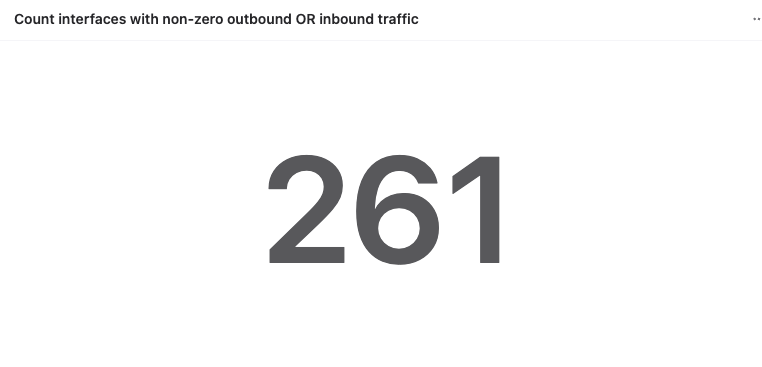

Count interfaces with non-zero outbound OR inbound traffic (with key existence check)
=====================================================================================

.. literalinclude:: count_if_nz_out_or_in_trfk.aql
   :language: aql

:download:`Download the Dashboard JSON here <count_if_nz_out_or_in_trfk.json>`
