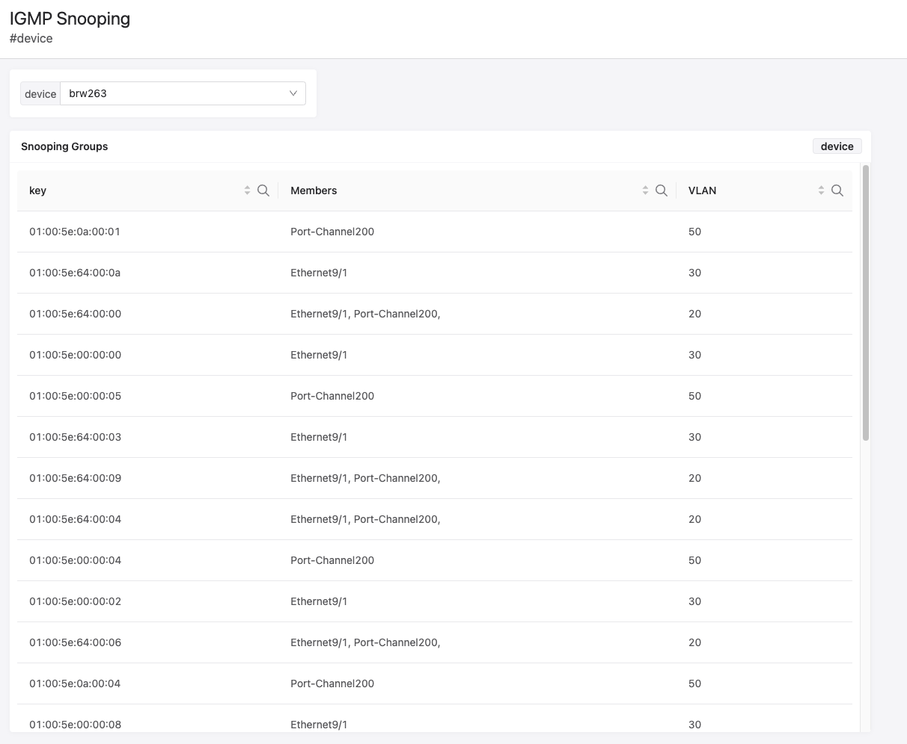

IGMP Snooping Table
===================

.. note::
   IGMP Snooping states are not streamed by default and they would need to be added to the TerminAttr include list using
   the tastreaming.TerminattrStreaming service API, e.g.:

   .. code::

   curl -sS -kX POST --header 'Accept: application/json' -b access_token=`cat token` \
      'https://192.0.2.1/api/v3/services/tastreaming.TerminattrStreaming/SubscribeTAPaths' \

      -d '{ "filter": { "app_name": "app1", "include_paths": [ "/Sysdb/bridging/igmpsnooping" ]}}'

.. literalinclude:: igmp_snooping.aql
   :language: aql

:download:`Download the Dashboard JSON here <igmp_snooping.json>`
