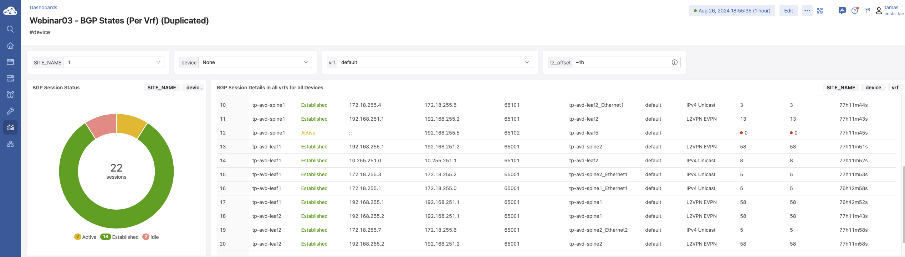
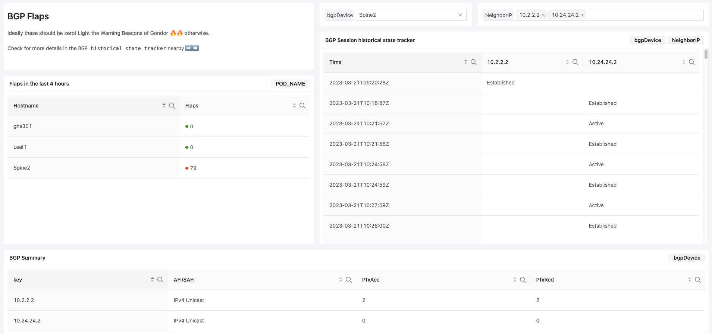

TAC Webinar03 2023 - BGP States
===============================

BGP Summary
-----------

.. literalinclude:: webinar03_bgp_states_bgp_sum.aql
   :language: aql

BGP Sessions Flaps
------------------

.. literalinclude:: webinar03_bgp_states_bgp_flaps.aql
   :language: aql

BGP Historical state tracker
----------------------------

.. literalinclude:: webinar03_bgp_states_hist_tracker.aql
   :language: aql

BGP Syslog Messages
-------------------

.. literalinclude:: webinar03_bgp_states_bgp_syslogs.aql
   :language: aql

.. image:: webinar03_bgp3.png
   :width: 600
   :alt: BGP Syslog Messages

:download:`Download the Dashboard JSON here <webinar03_bgp_states.json>`
