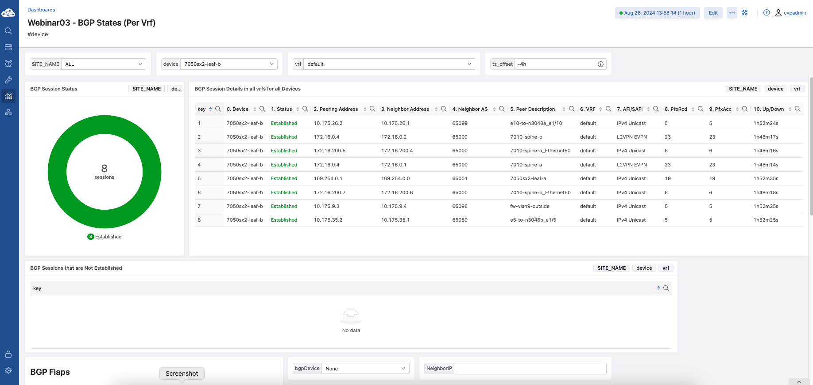

TAC Webinar03 2023 - BGP States
-------------------------------

This dashboards helps to provide current and historical BGP status and provides link flap counters.

.. note::
   Some of the BGP states are not streamed by default and the ``/Smash/routing/bgp/bgpPeerInfoStatus/default/bgpPeerStatisticsEntry`` needs to be added to the TerminAttr include list using the tastreaming.TerminattrStreaming service API.
   Examples can be found `here <../../index_examples.html#terminattrstreamingpermitlistnote>`_

Pre-requisites
^^^^^^^^^^^^^^

* Devices will need to be tagged with tag label ``site_name`` and the label value of the site's name, for example a customer has 3 sites: ABC, DEF, XYZ

      * Tag ``site_name:ALL`` to all devices
      * Tag ``site_name:ABC`` to ABC devices
      * repeat for DEF and XYZ

* Devices with multiple supervisors upon supervisor failover might not show the correct states

BGP Summary
^^^^^^^^^^^

.. literalinclude:: webinar03_bgp_states_bgp_sum.aql
   :language: aql

.. image:: webinar03_bgp1.png
   :width: 1400
   :alt: BGP Summary
   :align: center

.. image:: webinar03_bgp1_3.png
   :width: 1400
   :alt: BGP Summary23
   :align: center

BGP Sessions Flaps
^^^^^^^^^^^^^^^^^^

.. literalinclude:: webinar03_bgp_states_bgp_flaps.aql
   :language: aql

BGP Historical state tracker
^^^^^^^^^^^^^^^^^^^^^^^^^^^^

.. literalinclude:: webinar03_bgp_states_hist_tracker.aql
   :language: aql

.. image:: webinar03_bgp2.png
   :width: 1400
   :alt: BGP Flaps and Historical state tracker

BGP Syslog Messages
^^^^^^^^^^^^^^^^^^^

.. literalinclude:: webinar03_bgp_states_bgp_syslogs.aql
   :language: aql

.. image:: webinar03_bgp3.png
   :width: 1400
   :alt: BGP Syslog Messages

:download:`Download the Dashboard JSON here <webinar03_bgp_states.json>`
