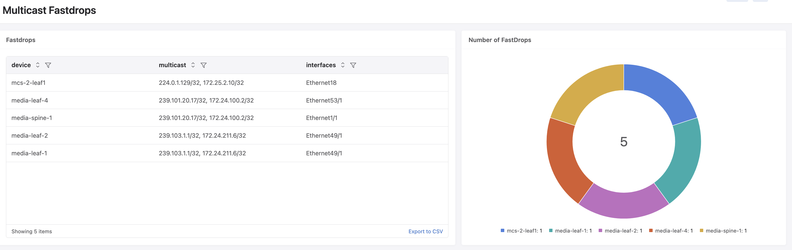

Multicast Fastdrops
-------------------

This dashboard shows all multicast fastdrop entries happening across all switches in the network. Fastdrops occur when multicast traffic is dropped in hardware due to missing or incomplete routing state.

For more information on multicast fastdrops, refer to the `Arista Community article <https://arista.my.site.com/AristaCommunity/s/article/multicast-fastdrops>`_ and the `EOS Multicast Architecture documentation <https://www.arista.com/en/um-eos/eos-multicast-architecture#xx1151589>`_.

.. note::
   The telemetry path ``/Sysdb/routing/hardware/multicast`` is not streamed by default and needs to be added to the TerminAttr include list using the ``tastreaming.TerminattrStreaming`` service API with app_name ``fastdrops``.
   Examples can be found `here <../../index_examples.html#terminattrstreamingpermitlistnote>`_

Pre-requisites
^^^^^^^^^^^^^^

* The multicast telemetry path must be ingested into CloudVision (see note above)
* Devices must be running multicast routing in the default VRF

Fastdrops
^^^^^^^^^

Lists all multicast fastdrop flows across all devices, showing the device, multicast group/source pair and affected interfaces.

.. literalinclude:: fastdrops.aql
   :language: aql

Number of Fastdrops
^^^^^^^^^^^^^^^^^^^

Shows the number of fastdrop flows per device as a donut chart, providing a quick overview of which devices are experiencing the most fastdrops.

.. literalinclude:: numFastdrops.aql
   :language: aql

:download:`Download the Dashboard JSON here <multicastFastdrops.json>`
