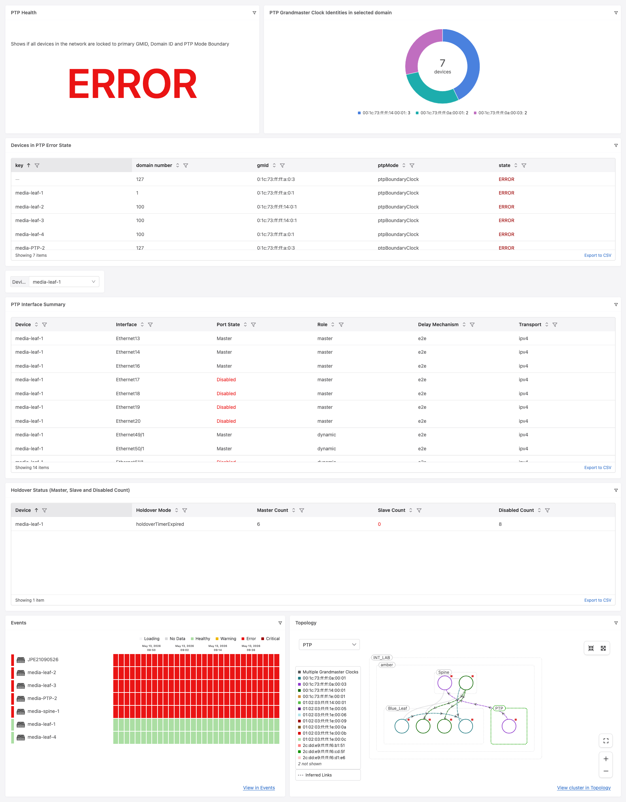
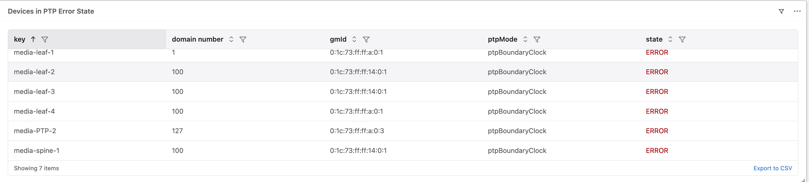
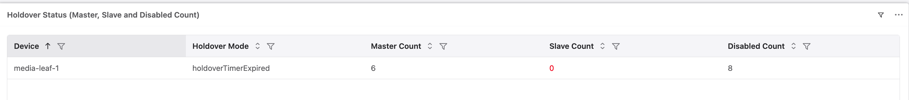
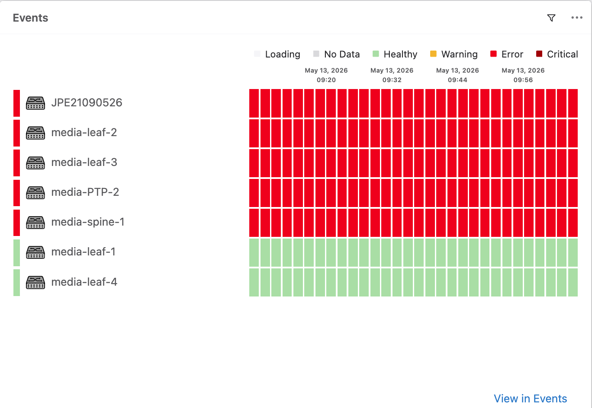
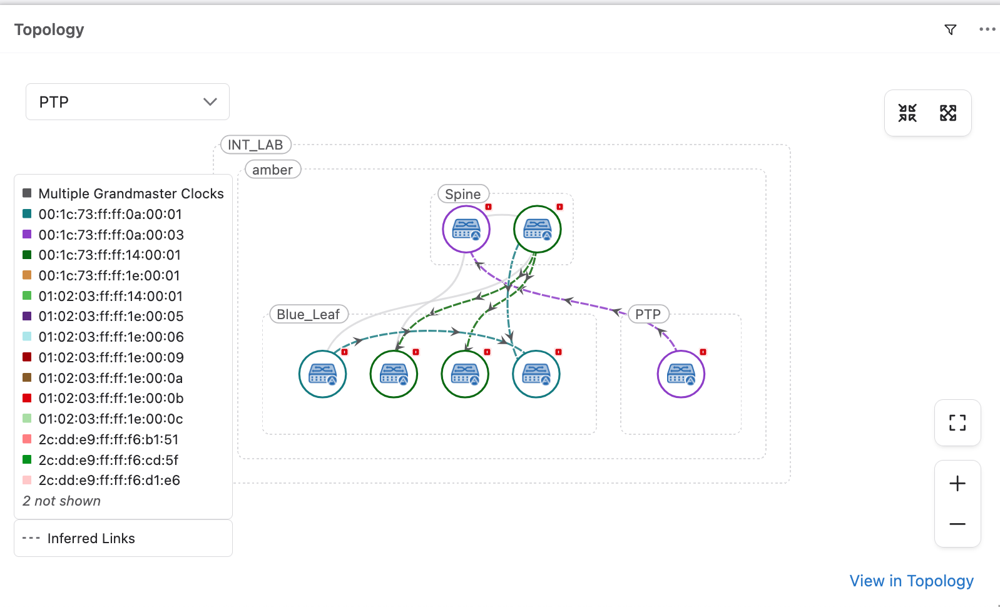

PTP Dashboards
---------------

This dashboard provides overall PTP health per PTP domain. It validates that all switches within a tagged PTP domain are locked to the expected Grandmaster ID, configured with the correct Domain ID, and running in PTP Boundary Clock mode. Discrepancies are shown via color-coded health indicators (OK/WARNING/ERROR).

The dashboard addresses the following use cases:

* **Inconsistent PTP GMID detection** -- An error is raised if tagged switches are not all locked to one of the expected GMIDs. A warning is raised if switches are not running ``ptp mode boundary``. Additionally, if all of the switches within the same PTP Domain are not locked to same GMID then a “WARNING” is shown.
* **Inconsistent PTP Domain ID detection** -- An error is raised if tagged switches are not configured with the correct domain ID.
* **PTP Interface Summary** -- Shows per-device PTP port status including role, port state, transport and delay mechanism.
* **Holdover Status** -- Shows per-device holdover mode and counts of Master, Slave and Disabled PTP ports.
* **PTP Events** -- Displays PTP-related events such as grandmaster changes, unexpected GMIDs and domain inconsistencies.

Pre-requisites
^^^^^^^^^^^^^^

* Devices must be tagged with the following tags in CloudVision (Provisioning > Tags within a workspace):

      * ``PTP_DOMAIN:<domain_name>`` -- identifies the group of switches belonging to a single PTP domain (e.g. ``PTP_DOMAIN:PROD``)
      * ``PTP_DomainID:<id>`` -- the expected PTP domain ID number (e.g. ``PTP_DomainID:127``)
      * ``PTP_GMID:<gmid>`` -- one or more expected Grandmaster IDs in hex format (e.g. ``PTP_GMID:00:02:c5:ff:fe:34:5b:40``)

* Review and submit the workspace to publish the tag assignments
* The dashboard uses input filters for ``DomainID``, ``GMID``, ``Domain`` (tag query) and ``Device`` to scope the widgets

PTP Health
^^^^^^^^^^

Shows if all devices in the network are locked to the primary GMID[s], correct Domain ID and PTP Mode Boundary. Returns a single value: ``OK``, ``WARNING`` (multiple valid GMIDs detected) or ``ERROR`` (misconfigurations found).

.. literalinclude:: ptpHealth.aql
   :language: aql

.. image:: PTPHealth.png
   :width: 1400
   :alt: PTP Health widget

GMID Input Variable
^^^^^^^^^^^^^^^^^^^

Populates the GMID multi-select input filter by reading PTP_GMID tag values from CloudVision.

.. literalinclude:: GMID_input.aql
   :language: aql

Devices in PTP Error State
^^^^^^^^^^^^^^^^^^^^^^^^^^

Lists all devices whose PTP configuration does not match the expected GMID, Domain ID, or PTP mode. Devices with valid configuration but multiple active GMIDs in the domain are shown with a ``WARN`` state.

.. literalinclude:: errorDevices.aql
   :language: aql

PTP Interface Summary
^^^^^^^^^^^^^^^^^^^^^

Shows per-device PTP port details for a selected device, including interface name, role, port state, transport mode and delay mechanism. Ports that are admin-disabled are excluded. Port states other than Master or Slave are highlighted in red.

.. literalinclude:: ptpInterfaceSummary.aql
   :language: aql

.. image:: ptpInterfaces.png
   :width: 1400
   :alt: PTP Interface Summary

Holdover Status
^^^^^^^^^^^^^^^

Displays the holdover mode and counts of Master, Slave and Disabled PTP ports per device. A Slave Count of 0 is highlighted in red as it may indicate a loss of PTP synchronization.

.. literalinclude:: ptpHoldOverStatus.aql
   :language: aql

PTP Events
^^^^^^^^^^

The events widget is configured to show the following PTP event types:

* ``INCONSISTENT_PTP_DOMAIN_ID``
* ``INCONSISTENT_PTP_GMID``
* ``PTP_DOMAIN_ID_GROUP``
* ``PTP_GRANDMASTER_GROUP``
* ``SYS_PTP_GRANDMASTER_CHANGE``
* ``UNEXPECTED_PTP_GMID``

Events are filtered by the ``Domain`` tag and show WARNING, ERROR and CRITICAL severities for non-maintenance devices.

PTP Topology
^^^^^^^^^^^^

The topology widget shows the network topology with the PTP overlay enabled, filtered by the ``Domain`` tag. This provides a visual representation of PTP roles and states across the network.

:download:`Download the Dashboard JSON here <PTPAQLDashboardsVer3.json>`
